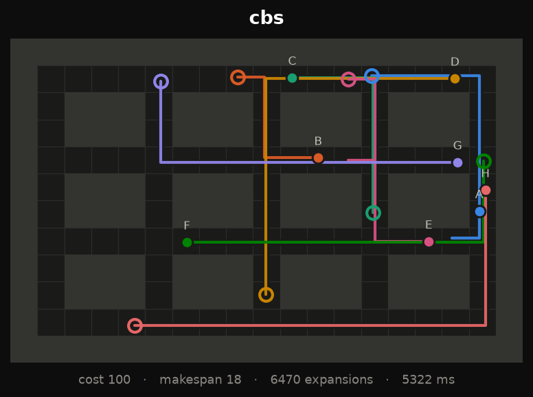
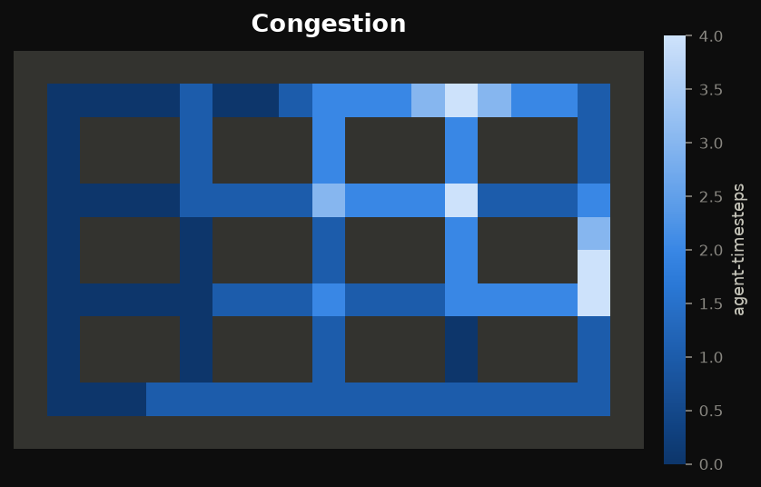
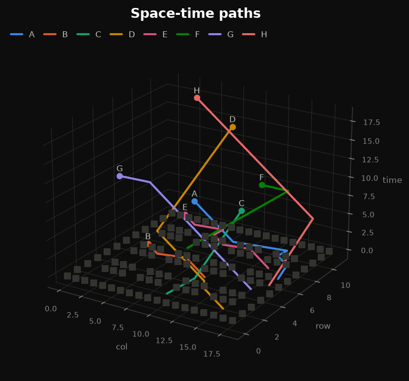
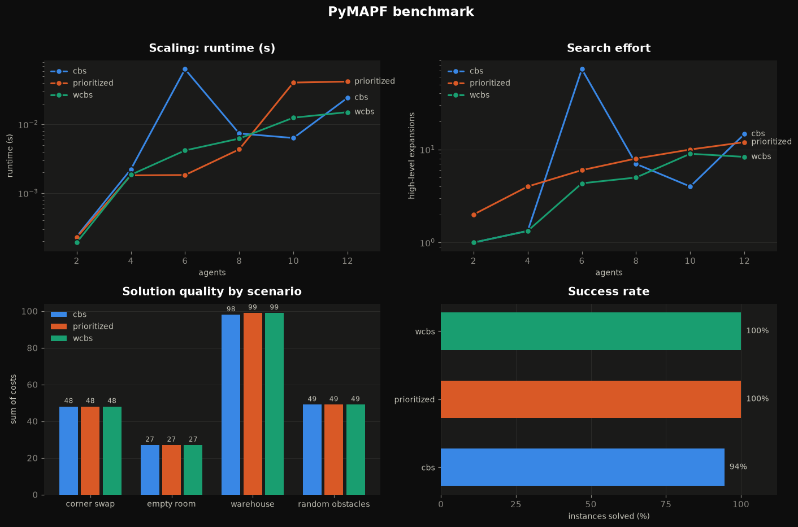

<div align="center">
    
     
    
</div>

<div align="center">

# PyMAPF

✨ A Python toolbox for Multi-Agents Planning (Centralized and Decentralized) ✨

</div>

<div align="center">
    


[](https://codecov.io/gh/APLA-Toolbox/pymapf)
[](https://www.codefactor.io/repository/github/apla-toolbox/pymapf)
[](http://isitmaintained.com/project/APLA-Toolbox/pymapf "Percentage of issues still open")

[](https://pypi.python.org/pypi/pymapf/)
[](https://github.com/Apla-Toolbox/pymapf/blob/master/LICENSE)
[](https://GitHub.com/Apla-Toolbox/pymapf/graphs/contributors/)

</div>

<div align="center">
    
[Report Bug](https://github.com/APLA-Toolbox/pymapf/issues) · [Request Feature](https://github.com/APLA-Toolbox/pymapf/issues)

Loved the project? Please consider [donating](https://www.buymeacoffee.com/dq01aOE) to help it improve!

</div>

## Features 🌱

- 🎮 **[Interactive playground](https://apla-toolbox.github.io/pymapf/)** — run the solvers in your browser, watch the search resolve conflicts live
- 🧭 Centralized planners: Space-Time A\*, Prioritized Planning, **Conflict-Based Search**, **Weighted CBS** (bounded suboptimal)
- 🧩 Pluggable solver framework with a name-based registry, pluggable heuristics and deterministic maps
- 🔭 **Observable search**: every solver streams `SearchEvent`s — record them, animate them, or watch them live
- 🗺️ **Six reproducible scenario families** (empty room, random obstacles, warehouse, maze, bottleneck, corner swap) plus ASCII maps
- 📊 **Benchmark harness** with CSV/JSON export and ready-made charts
- 🎬 **Visualisation**: static plots, congestion heatmaps, space-time cubes, timelines, GIF/MP4 animations, live views (window *or* terminal)
- 🔎 Reactive distributed planners (Nonlinear Model Predictive Control, Velocity Obstacles)
- 🪶 Zero runtime dependencies in the core — the solvers are pure standard library

<div align="center">


<em>CBS finding and resolving conflicts, node by node — produced by <code>pymapf.viz.animate_search</code></em>

</div>

## Install 🖇️

```bash
pip install pymapf                 # the solver framework — no dependencies
pip install "pymapf[viz]"          # + plots, animations and live views
pip install "pymapf[all]"          # + the decentralized/legacy planners
```

From a clone:

```bash
git clone https://github.com/apla-toolbox/pymapf && cd pymapf
pip install -e ".[all,dev]"
pytest
```

## Usage 📑

### Quickstart 🧭

Cells are `(row, col)`; a truthy grid value marks an obstacle.

```python
import pymapf

grid = pymapf.GridMap([
    [0, 0, 0],
    [0, 1, 0],   # a wall in the middle
    [0, 0, 0],
])
problem = pymapf.MAPFProblem(grid, [
    pymapf.Agent("a", start=(0, 0), goal=(2, 2)),
    pymapf.Agent("b", start=(2, 0), goal=(0, 2)),
])

print(pymapf.available_solvers())          # ['cbs', 'prioritized', 'wcbs']

solution = pymapf.solve(problem, "cbs")
print(solution.sum_of_costs, solution.makespan, solution.is_valid())
for name, path in solution.paths.items():
    print(name, path)                      # path[t] is the cell at timestep t
```

### Choosing a solver 🧠

| Solver | Name | Guarantee | Use it when |
|---|---|---|---|
| Conflict-Based Search | `"cbs"` | optimal sum-of-costs | you need the best plan and can pay for it |
| Weighted CBS | `"wcbs"` | cost ≤ `w` × optimal | you need most of the quality, much faster |
| Prioritized Planning | `"prioritized"` | none (incomplete) | you need an answer in milliseconds |

CBS is exponential in the number of conflicts, so give it a budget on hard maps:

```python
solution = pymapf.solve(problem, "cbs", time_limit=5.0)      # None if it runs out
bounded  = pymapf.solve(problem, "wcbs", weight=1.5)         # within 50% of optimal
```

### Scenarios 🗺️

Reproducible instances, deterministic in their seed:

```python
scenario = pymapf.build_scenario("warehouse", n_agents=8, seed=3)
solution = pymapf.solve(scenario.to_problem(), "wcbs")

print(pymapf.available_scenarios())
# ['bottleneck', 'corner_swap', 'empty_room', 'maze', 'random_obstacles', 'warehouse']
```

Or write the map by hand — lowercase is a start, uppercase the matching goal:

```python
from pymapf.scenarios import from_ascii

scenario = from_ascii("""
##########
#a......A#
#.######.#
#B......b#
##########
""")
```

### Watching the search 🔭

Solvers push `SearchEvent`s to any callable you pass as `observer`:

```python
trace = pymapf.SearchTrace()
solution = pymapf.solve(scenario.to_problem(), "cbs", observer=trace)

print(trace.summary())
# {'events': 67, 'expansions': 16, 'conflicts': 15, 'solved': True, 'cost': 48, ...}
```

Live, while it runs — in a window, or in the terminal over SSH:

```python
from pymapf.viz import LiveSolveView, LiveConsoleView

with LiveConsoleView(scenario) as view:                    # no display needed
    pymapf.solve(scenario.to_problem(), "cbs", observer=view)
```

### Visualisation 🎬

```python
from pymapf import viz

viz.save(viz.plot_solution(solution, scenario), "plan.png")
viz.save(viz.plot_congestion(solution, scenario), "congestion.png")   # traffic hot spots
viz.save(viz.plot_spacetime(solution, scenario), "spacetime.png")     # the 3D search cube
viz.save(viz.plot_timeline(solution), "timeline.png")                 # who waits, when

viz.save_animation(viz.animate_solution(solution, scenario), "plan.gif", fps=16)
viz.save_animation(viz.animate_search(trace, scenario), "search.mp4")
```

| | | |
|---|---|---|
|  |  |  |
| `plot_solution` | `plot_congestion` | `plot_spacetime` |

### Benchmarking 📊

```python
from pymapf.benchmark import compare_algorithms, scaling_study
from pymapf import viz

report = compare_algorithms(["warehouse", "maze"], ["cbs", "wcbs", "prioritized"], time_limit=2.0)
print(report.table())
report.to_csv("results.csv")

scaling = scaling_study("random_obstacles", agent_counts=(2, 4, 6, 8, 10, 12))
viz.dashboard(scaling, report).savefig("dashboard.png")
```



### Adding your own solver 🔌

```python
from pymapf.core import MAPFSolver, Solution, register_solver
from pymapf.algorithms import space_time_astar


@register_solver("selfish")
class Selfish(MAPFSolver):
    """Every agent takes its own shortest path and ignores the others."""

    def solve(self, problem, observer=None):
        paths = {
            agent.name: space_time_astar(problem.grid, agent.start, agent.goal)
            for agent in problem.agents
        }
        return Solution(paths=paths, algorithm=self.name)


pymapf.solve(problem, "selfish").first_conflict()   # spoiler: there is one
```

### Reactive planners 🔎

```python
from pymapf.decentralized import MultiAgentNMPC
from pymapf.decentralized.position import Position
import numpy as np

sim = MultiAgentNMPC()
sim.register_agent("r2d2", Position(0, 3), Position(10, 7))
sim.register_agent("bb8", Position(0, 7), Position(5, 10))
sim.register_agent("c3po", Position(10, 7), Position(5, 0))
sim.register_obstacle(2, np.pi / 4, Position(0, 0))
sim.run_simulation()
sim.visualize("filename_test", 10, 10)
```

```python
from pymapf.decentralized.velocity_obstacle import MultiAgentVelocityObstacle
from pymapf.decentralized.position import Position

sim = MultiAgentVelocityObstacle(simulation_time=8.0)
sim.register_agent("r2d2", Position(0, 3), Position(10, 7))
sim.register_agent("bb8", Position(0, 7), Position(5, 10))
sim.register_agent("c3po", Position(10, 7), Position(5, 0))
sim.run_simulation()
sim.visualize("filename_test_2", 10, 10)
```

### Scripts 💨

```bash
python scripts/generate_gallery.py     # every figure in docs/assets
python scripts/make_promo.py           # the promo film
python scripts/build_web_bundle.py     # refresh the playground's copy of the library
python scripts/switch_positions_nmpc.py
```

### The playground 🌐

`docs/` is a static site that runs PyMAPF in the browser under Pyodide — the
same source files, loaded into a WebAssembly interpreter, with a JavaScript port
of the solvers as an instant-response fallback. Serve it locally with:

```bash
python -m http.server -d docs 8000
```

## Cite 📰

If you use the project in your work, please consider citing it with:
```
@misc{https://doi.org/10.13140/rg.2.2.14030.28486,
  doi = {10.13140/RG.2.2.14030.28486},
  url = {http://rgdoi.net/10.13140/RG.2.2.14030.28486},
  author = {Erwin Lejeune and Sampreet Sarkar},
  language = {en},
  title = {Survey of the Multi-Agent Pathfinding Solutions},
  publisher = {Unpublished},
  year = {2021}
}
```

List of publications & preprints using `pymapf` (please open a pull request to add missing entries):

* [Survey of MAPF solutions](https://www.researchgate.net/publication/348716625_Survey_of_the_Multi-Agent_Pathfinding_Solutions) (January 2021)

## Contribute 🆘

Open an issue to state clearly the contribution you want to make. Upon aproval send in a PR with the Issue referenced. (Implement Issue #No / Fix Issue #No).

## Maintainers Ⓜ️

- Erwin Lejeune
- Sampreet Sarkar
